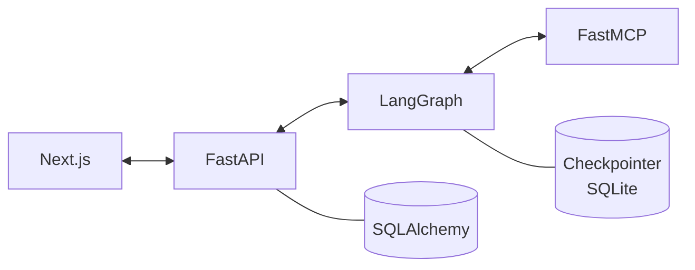

# Langgraph Chatbot


Simple project to understand an AI agentic codebase.

## Stack

| Layer | Tech | Where |
| --- | --- | --- |
| Frontend | Next.js 16, React 19, Tailwind 4 | `apps/frontend` |
| API | FastAPI + Uvicorn | `apps/fast_api.py` |
| Agent | LangGraph + LangChain (OpenAI) | `packages/lang_graph.py` |
| Tools | FastMCP (TMDB, calculator) | `apps/fast_mcp.py` |
| Persistence | SQLAlchemy + SQLite | `packages/sql_alchemy.py` |
| Memory | LangGraph SQLite checkpointer | `app.db` |

## Architecture



## Commands

Run everything with Docker (frontend, fast-api, fast-mcp):

```bash
docker compose -f docker/docker-compose.yml up --build
```

Or run each piece locally:

```bash
pip install -r requirements.txt
python -m apps.fast_mcp                  # MCP server on :7000
fastapi dev apps/fast_api.py             # API on :8000
cd apps/frontend && npm install && npm run dev   # UI on :3000
```

Format Python:

```bash
ruff format
```

## Environment

`.env` at the repo root:

```
OPENAI_API_KEY=
GOOGLE_API_KEY=
TMDB_API_KEY=
```
